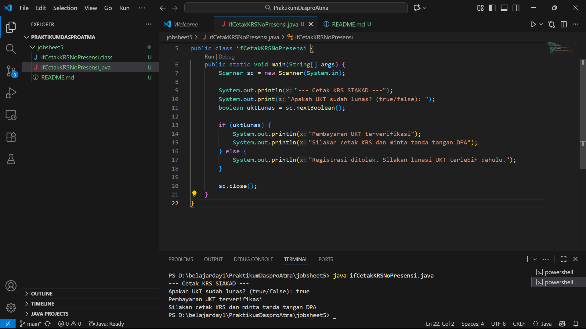
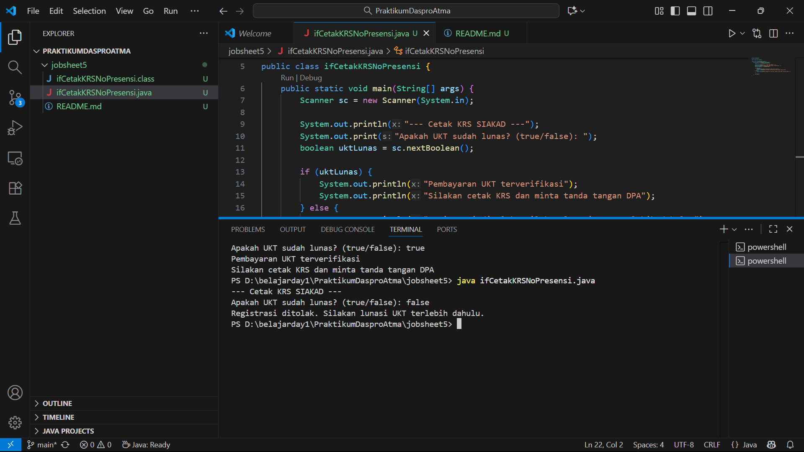

## Percobaan 1 - ifCetakKRSNoPresensi.java

### Mengapa pengecekan pada struktur if tersebut tidak melibatkan kondisi dengan operator relasional?
Karena pada variabel "uktLunas" disitu sudah bertipe boolean,yang artinya ia hanya memiliki 2 nilai yaitu true dan false sehingga tak perlu gunakan operator relasional.

### Saat program dijalankan, kemudian Anda mengisikan nilai false, bagaimana hasilnya?
Karena kita belum menambahkan kondisi else pada kode if tersebut maka ketika kita isi di terminal false maka program akan berhenti atau tidak lanjut berjalan.

### Modifikasi Program dengan Struktur ELSE

## Percobaan 2 SWITCH CASE untuk mencetak KRS

## Pertanyaan

### Apa fungsi dari sintaks break? 
break digunakan untuk keluar dari loop secara paksa, meskipun kondisi loop belum bernilai false.

### Apa peran dari sintaks default pada struktur pemilihan SWITCH-CASE?
default berfungsi sebagai penangan kondisi ketika tidak ada satu pun case yang cocok dengan nilai yang diuji.

### Hasil Modif if else if

## Percobaan 3: Nested IF untuk Mengecek Syarat Ujian Skripsi 

## Pertanyaan

### Apa yang terjadi jika mahasiswa menjawab "No" pada pertanyaan bebas kompen?mengapa demikian?
Jika mahasiswa menjawab "No" pada pertanyaan “Apakah mahasiswa sudah bebas kompen?”, maka program akan menampilkan pesan bahwa mahasiswa belum bebas kompen dan tidak dapat mengikuti ujian skripsi. Hal ini karena logika if-else dalam program dirancang untuk menghentikan proses ketika jawaban bukan "Yes", sehingga hanya mahasiswa yang benar-benar bebas kompen yang bisa melanjutkan ke tahap berikutnya.

### Jelaskan maksud dari potongan kode berikut!
Potongan kode if "(bimbinganP1 >= 8 && bimbinganP2 >= 4)" berfungsi untuk memeriksa apakah mahasiswa telah memenuhi jumlah minimal bimbingan dengan dosen pembimbing 1 sebanyak 8 kali dan dosen pembimbing 2 sebanyak 4 kali. Jika kedua syarat tersebut terpenuhi (kedua kondisi bernilai benar), maka mahasiswa dinyatakan layak untuk mengikuti ujian skripsi.

### Penjelasan alur
Alur pemeriksaan dimulai dari pertanyaan apakah mahasiswa sudah bebas kompen? dan Jika jawabannya “Yes” maka program melanjutkan untuk meminta jumlah bimbingan dengan pembimbing 1 dan pembimbing 2. Selanjutnya, program memeriksa apakah jumlah bimbingan pembimbing 1 minimal 8 kali dan pembimbing 2 minimal 4 kali. Jika kedua syarat terpenuhi, mahasiswa dinyatakan siap ujian skripsi, namun jika salah satu syarat tidak terpenuhi, maka mahasiswa belum memenuhi ketentuan dan tidak dapat mengikuti ujian.

